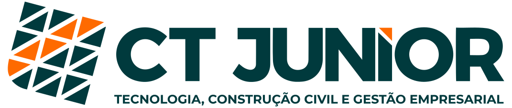

  

<!-- TABLE OF CONTENTS -->
<h2 id="summary"> :book: Sumário</h2>

  
Sumário

  <ol>
    <li><a href="#sobre"> ➤ Sobre</a></li>
    <li><a href="#tecnologias"> ➤ Tecnologias</a></li>
    <li><a href="#creditos"> ➤ Creditos</a></li>
  </ol>

<!-- ABOUT THE PROJECT -->
<h2 id="sobre"> :pencil: Sobre</h2>

Repositório destinado ao nosso website institucional, criado em <b>2022</b>.

<!-- ABOUT THE PROJECT -->
<h2 id="tecnologias"> :hammer: Tecnologias</h2>

### Front-End
<ul>
    <li><a href="https://nextjs.org/" title="Next.js"> Next Js</a></li>
    <li><a href="https://www.typescriptlang.org/" title="Typescript"> Typescript</a></li>
    <li><a href="https://reactjs.org/" title="React"> React Js</a></li>
    <li><a href="https://yarnpkg.com/" title="Yarn"> Yarn</a></li>
    <li><a href="https://code.visualstudio.com/" title="Visual Studio Code"> Visual Studio Code</a></li>
</ul>

<!-- ABOUT THE PROJECT -->
<h2 id="creditos"> :busts_in_silhouette: Créditos</h2>

#### Protótipo/Figma
- [Julia Caldeira](https://www.linkedin.com/in/julia-caldeira-mendon%C3%A7a-3198bb1b0/)

#### Desenvolvimento Front-end
- [André Altoé](https://www.linkedin.com/in/andre-altoe/)
- [Heber Lima](https://www.linkedin.com/in/h%C3%A9ber-lima-silva-2796ba179/)
- [Henrycky Wottikosky](https://www.linkedin.com/in/henrycky-wottikosky-5568a0166/)

### Huge thanks to Vercel

